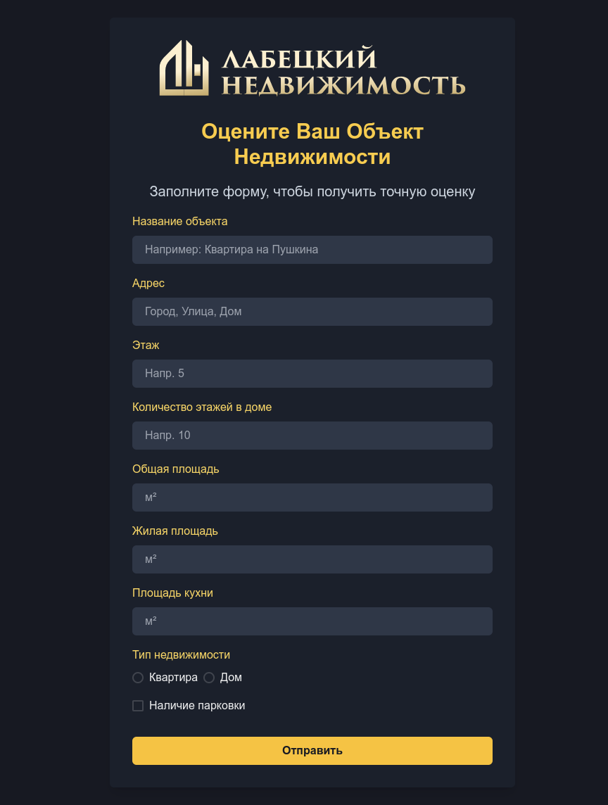

# Тестовое задание

## Основные технологии

- **Next.js**: Фреймворк для React с поддержкой SSR и SSG.
- **TypeScript**: Статическая типизация для JavaScript.
- **Chakra UI**: Компоненты для быстрого создания UI с поддержкой тем.
- **Formik**: Управление состоянием формы.
- **Yup**: Валидация данных.

## Установка и запуск

### Локально

1. **Установка зависимостей:**
   ```bash
   pnpm install
   ```

2. **Запуск в режиме разработки:**
   ```bash
   pnpm dev
   ```

## Тестирование

В проекте используется **Jest** и **React Testing Library** для тестирования компонентов и взаимодействия с Formik.

### Запуск тестов

```bash
pnpm run test
```

### Покрытие тестами

```bash
pnpm run test:coverage

```